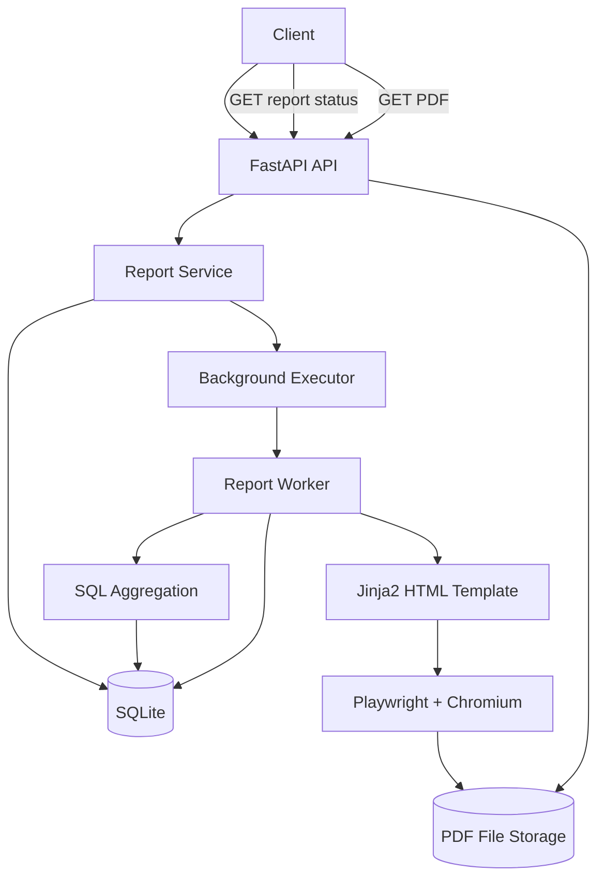

# FlyRank PDF Report Generator

A backend service that generates sales reports as PDF files using background processing.

## Overview

The project demonstrates a practical backend job pipeline:

**SQL aggregation → HTML rendering → PDF generation → background job → artifact storage → API**

The system creates a report request, immediately returns a job ID, processes the report in the background, and stores the generated PDF on disk.

## Tech Stack

* Python 3.11
* FastAPI
* SQLite
* Jinja2
* Playwright + Chromium
* Uvicorn
* ThreadPoolExecutor

## Architecture



## API Endpoints

### Health Check

```http
GET /health
```

Returns:

```json
{"status": "ok"}
```

### Create Report

```http
POST /reports
Idempotency-Key: unique-key
```

Returns immediately:

```json
{
  "id": "report-id",
  "status": "queued",
  "download_url": "/reports/report-id/file"
}
```

### Get Report Status

```http
GET /reports/{report_id}
```

Returns the current status:

* `queued`
* `running`
* `completed`
* `failed`

### Download Report

```http
GET /reports/{report_id}/file
```

Returns the generated PDF.

## Background Processing

Report generation is handled by `ThreadPoolExecutor`.

The API does not wait for PDF generation to finish. Instead:

1. Create a report with `queued` status.
2. Submit the job to the background executor.
3. Worker changes status to `running`.
4. SQL queries generate the report data.
5. Jinja2 renders the HTML.
6. Playwright/Chromium generates the PDF.
7. PDF path is stored in SQLite.
8. Job becomes `completed`.

If an error occurs, the worker stores the error message and changes the status to `failed`.

## Idempotency

The API supports an `Idempotency-Key`.

If the same key is submitted again, the existing report is returned instead of creating another report.

This prevents duplicate report generation when clients retry requests.

## Project Structure

```text
flyrank-be08-pdf-report-generator/
│
├── app/
│   ├── main.py
│   ├── database.py
│   ├── report_queries.py
│   ├── report_service.py
│   ├── report_worker.py
│   ├── pdf_generator.py
│   └── templates/
│       └── report.html
│
├── scripts/
│   ├── seed.py
│   ├── test_report_data.py
│   └── generate_test_pdf.py
│
├── reports/
├── requirements.txt
├── README.md
└── .gitignore
```

## Running Locally

Create and activate the virtual environment:

```bash
python -m venv .venv
source .venv/Scripts/activate
```

Install dependencies:

```bash
pip install -r requirements.txt
playwright install chromium
```

Seed the database:

```bash
python scripts/seed.py
```

Start the API:

```bash
python -m uvicorn app.main:app --port 8001
```

Health check:

```bash
curl http://127.0.0.1:8001/health
```

Create a report:

```bash
curl -X POST http://127.0.0.1:8001/reports \
  -H "Idempotency-Key: test-001"
```

Then use the returned report ID to check its status:

```bash
curl http://127.0.0.1:8001/reports/<REPORT_ID>
```

## Validation

The project was tested for:

* Python compilation
* API health endpoint
* Report creation
* Background processing
* PDF generation
* PDF download
* Idempotent requests
* Worker failure handling
* Report status tracking

## Git History

The implementation was developed incrementally:

```text
Stage 0 — Setup
Stage 1 — Seed database
Stage 2 — Aggregation queries
Stage 3 — HTML to PDF rendering
Stage 4 — Report API and artifact handling
Stage 5 — Idempotent report creation
Stage 6 — Background report processing
Documentation — Architecture and README
```

## Assignment

**BE-08 — Backend AI Engineering**

The project demonstrates SQL aggregation, API design, idempotency, background jobs, error handling, artifact storage, HTML templating, and PDF generation.
